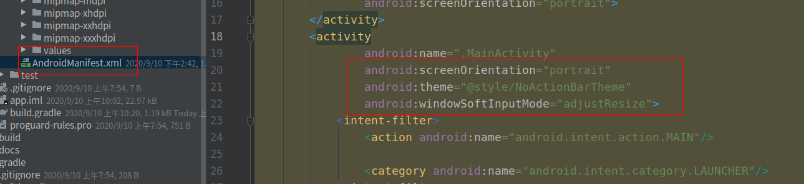
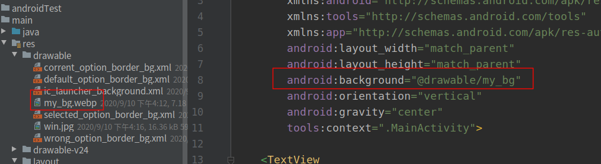
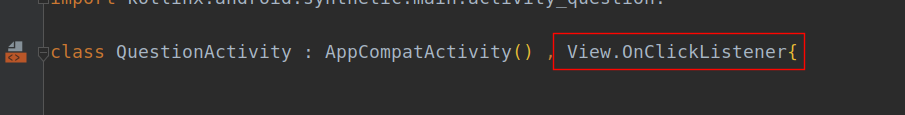
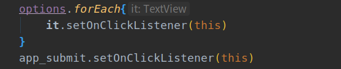
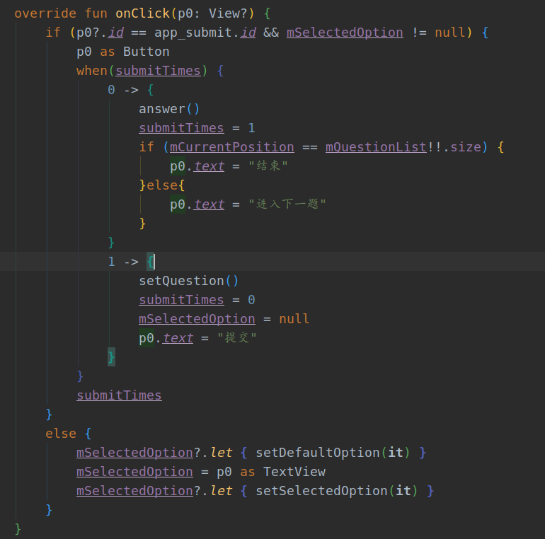
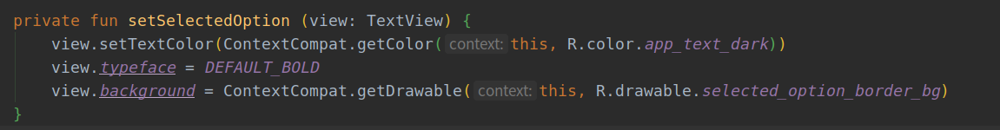
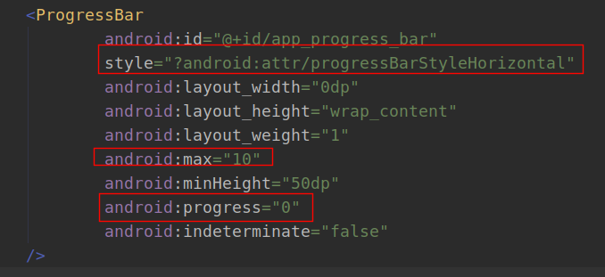
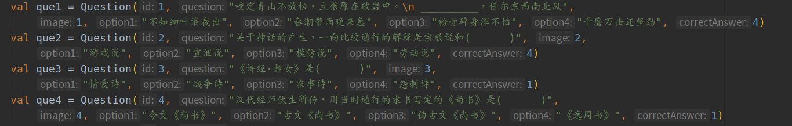

# Android & Kotlin：知识问答app

学习Android第二天，今天写一个知识问答app。

## 1.app功能

+ 开始界面输入挑战题目数目
+ 跳转到答题界面
+ 答题部分通过选择选项进行答题
+ 提交后，正确答案显示绿色，错误答案显示红色
+ 题目全部答完跳转到结果页面
+ 结果页面显示题目错对情况
+ 结束页面点击结束跳转到开始界面

先来效果展示：


## 2.涉及很多新的知识点

+ activity全局设置
+ activity之间切换
+ drawable的使用
+ activity之间传递参数
+ OnClickListener全局设置
+ ContextCompat获取设置
+ 全屏显示
+ 输入框使用
+ 进度条使用

### 2.1. activity全局设置

+ 可以设置主题，方向，软键盘等系统整体设置



### 2. 2 activity之间切换

+ 通过使用`Intent`进行activity之间的转换

```java
startActivity(Intent(this, MainActivity::class.java))
```

### 2.3 drawable的使用

drawable用来创建自己的样式，一些背景展示

+ 通过图片设置背景



+ 通过一个xml文件设置组建样式

```java
<?xml version="1.0" encoding="utf-8"?>
<shape xmlns:android="http://schemas.android.com/apk/res/android"
       android:shape="rectangle"
>
<!--    边处理   -->
    <stroke
            android:width="1dp"
            android:color="@color/colorPrimary"
    />
<!--    整体背景  -->
    <solid android:color="@android:color/white"/>
<!--    边角处理  -->
    <corners android:radius="5dp"/>
</shape>
```

### 2.4 activity之间传递参数

+ 通过`intent`的`putExtra`方法传入参数
+ 通过`getStringExtra`获取参数
+ 开始界面出入题目数量

```java
intent.putExtra(Constants.QUESTION_COUNT, questionCount)
```

+ 答题界面获取答题数量

```java
questionCount = intent.getStringExtra(Constants.QUESTION_COUNT).toString().toInt()
```


### 2.5 OnClickListener全局设置

+ 由于答题页面好几个组建需要触发onClick
+ 通过继承`View.OnClickListener`统一使用onClick进行处理



+ 组建直接绑定本类



+ 通过`View.OnClickListener`的`onClick`统一处理所有点击



### 2.6 ContextCompat获取设置

通过ContextCompat获取写在xml文件中的设置

+ R 代表 res文件夹，自己创建的样式都在R中



### 2.7 全屏显示

通过`window.decorView.systemUiVisibility = View.SYSTEM_UI_FLAG_FULLSCREEN`设置全屏显示


### 2.8 输入框使用

输入框使用的是`material`中的组建，需要添加依赖，这里可能会提示版本可以升级，最好不要升级，我升级后运行报错。

```java
implementation 'com.google.android.material:material:1.0.0'
```

### 2.9 进度条使用

+ `?android:attr`使用Android系统自带的style类型
+ max设置进度条一共多少部分
+ progress设置目前在第几部分



## 3. 数据

### 3.1 question类

+ 问题和四个选项以及答案
+ 有些题可能会有图片

```java
/**
 * @author: ffzs
 * @Date: 2020/9/10 上午10:27
 */

data class Question (
    val id:Int,
    val question:String,
    val image:Int,
    val option1:String,
    val option2:String,
    val option3:String,
    val option4:String,
    val correctAnswer:Int
)
```

### 3.2 获取数据

本想找个题库网站爬点数据，没想到基本没有啊，只能找一个doc文件，处理一下字符串：

```Python
ss = """
8．下列关于旗帜的诗句中，属于宋玉所作的是(      )
A．凤皇翼其承旂兮，高翱翔之翼翼
B．驾八龙之婉婉兮，载云旗之委蛇
C．载云旗之委蛇兮，扈屯骑之容容
D．乘赤豹兮从文狸，辛夷车兮结桂旗
9．除分析秦亡的原因外，贾山《至言》着重讨论的另一问题是(      )
A．经济发展问题	B．礼仪制度问题
C．君臣关系问题	D．统一思想问题
   """

q_lst = []
for item in ss.strip().split("\n"):
    if ('\t' in item):
        q_lst.extend(item.split('\t'))
    else:
        q_lst.append(item)
q_lst = [it.split('．')[1] for it in q_lst]
for i,v in enumerate(q_lst[::5]):
    question = """val que{0} = Question({0}, "{1}", {0}, "{2}", "{3}", "{4}", "{5}", {0})""".format(i+9, v, q_lst[i*5+1],q_lst[i*5+2],q_lst[i*5+3],q_lst[i*5+4])
    print(question)
```

+ 处理之后直接粘贴到java代码中：



## 4. 源码

github